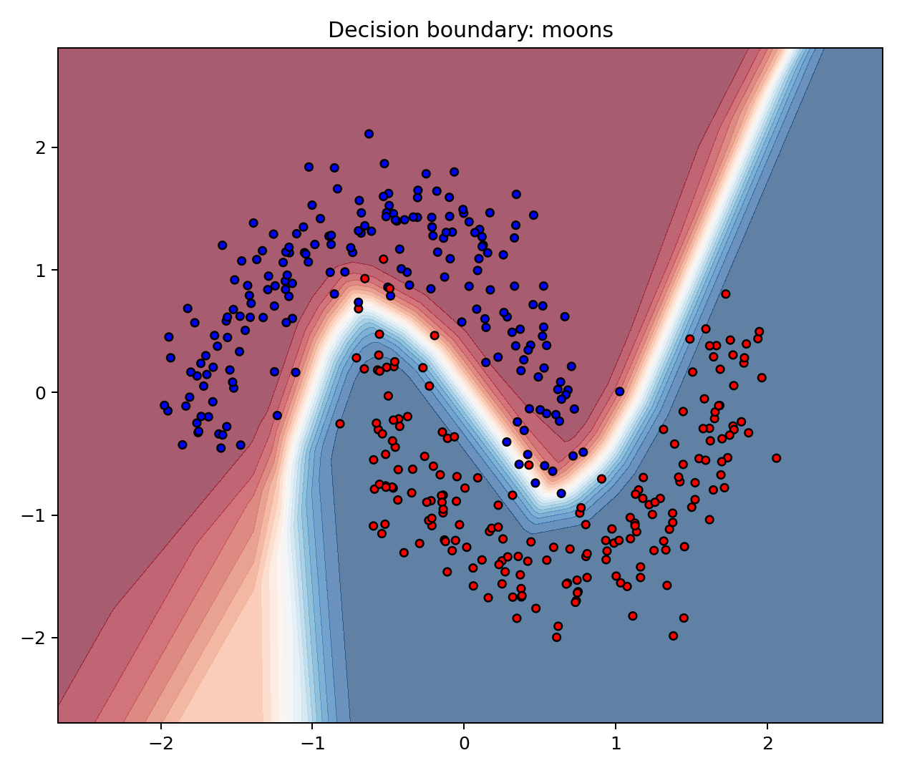
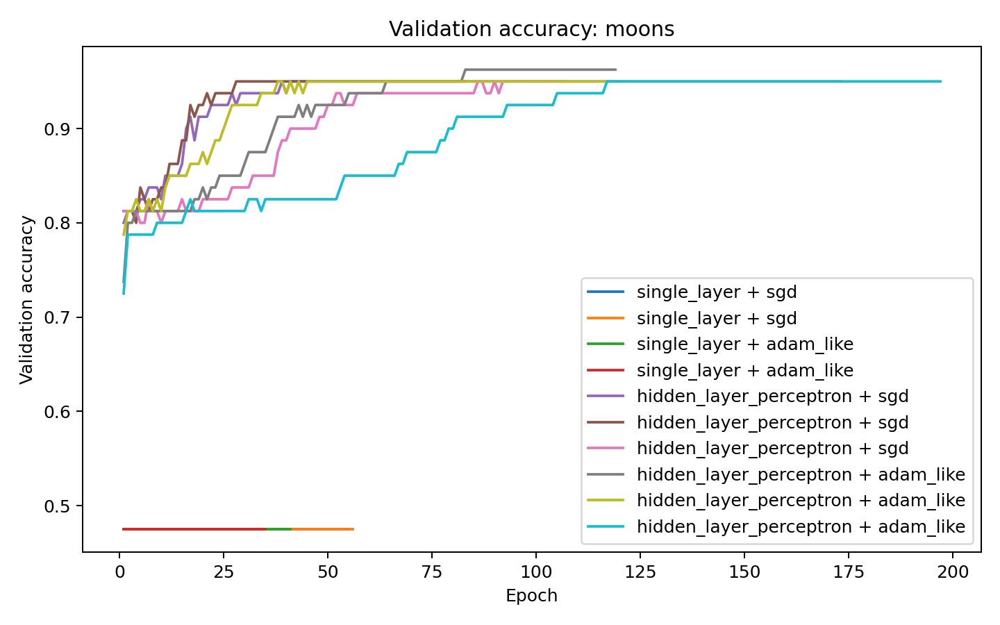
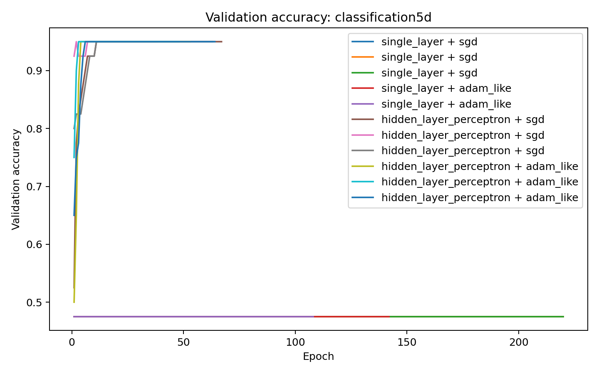
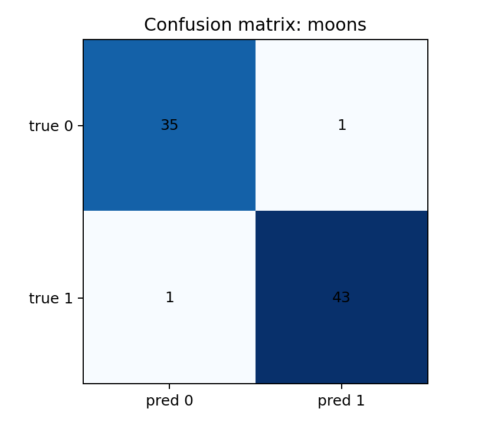
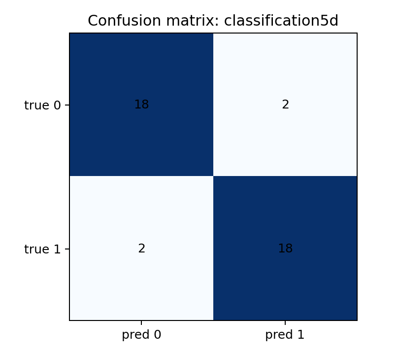

# Отчет по лабораторной работе №4

## Что реализовано

В работе реализованы без использования DL-фреймворков:

1. Однослойная сеть для бинарной классификации `Linear -> BReLU -> Sigmoid`.
2. Перцептрон с одним скрытым слоем `Linear -> BReLU -> Linear -> Sigmoid`.
3. Функция потерь `Binary Cross-Entropy`.
4. Оптимизатор `SGD` с настраиваемым размером батча, momentum и Nesterov.
5. Модификация `Adam`, в которой объединены momentum/Nesterov и RMSProp-подобное масштабирование градиента.

## Математическая часть

### Активации

В качестве основной активации используется ограниченная ReLU:

`BReLU(x) = min(1, max(0, x))`

Ее производная в реализации берется как:

1. `1`, если `0 < x < 1`
2. `0`, если `x <= 0` или `x >= 1`

На выходе используется:

`Sigmoid(x) = 1 / (1 + exp(-x))`

### Функция потерь

Для бинарной классификации используется:

`L = - mean(y * log(p) + (1 - y) * log(1 - p))`

где `p` - вероятность положительного класса после `sigmoid`.

### Оптимизаторы

`SGD` реализован в mini-batch варианте и поддерживает:

1. размер батча
2. momentum
3. Nesterov lookahead

`Adam-like` реализован как комбинация:

1. экспоненциального сглаживания градиента, как в momentum/Adam
2. адаптивного масштабирования по второй статистике градиента, как в RMSProp/AdaGrad-подобных методах
3. Nesterov-подобного lookahead для первой статистики

## Датасеты

Используются два набора данных по постановке:

1. `make_moons(n_samples=400, noise=0.15, random_state=ISU_ID)`
2. `make_classification(n_samples=200, n_features=5, n_redundant=2, n_informative=2, n_clusters_per_class=2, n_classes=2, random_state=ISU_ID)`

Разбиение выполнено в пропорции:

1. train: 60%
2. validation: 20%
3. test: 20%

В коде `ISU_ID` вынесен в [config.py](/Users/vitamija/online-courses/metopt-lab4/src/config.py) и может быть переопределен через переменную окружения `ISU_ID`.

## Структура проекта

1. `src/activations.py` - BReLU и Sigmoid.
2. `src/losses.py` - binary cross-entropy.
3. `src/models.py` - однослойная модель и MLP с одним скрытым слоем.
4. `src/optimizers.py` - SGD и Adam-like.
5. `src/training.py` - mini-batch обучение с early stopping.
6. `src/experiments.py` - подбор гиперпараметров, запуск экспериментов и построение графиков.

## План исследования

1. Для каждого датасета обучаются обе модели.
2. Для каждой модели перебираются несколько комбинаций `optimizer / learning_rate / batch_size`.
3. На validation-части выбирается лучшая конфигурация.
4. После этого считаются метрики на test-части и сохраняются графики обучения.

## Результаты экспериментов

Итоговая сводка сохраняется в `img/summary.csv`. Лучшие конфигурации получились такими.

### Moons

1. Лучшая модель: `hidden_layer_perceptron`
2. Лучший оптимизатор: `adam_like`
3. `learning_rate = 0.005`
4. `batch_size = 16`
5. Лучшая эпоха: `94`
6. Число обучаемых параметров: `49`
7. Validation accuracy: `0.9625`
8. Test accuracy: `0.975`
9. Test F1: `0.9773`

### Classification5D

1. Лучшая модель: `hidden_layer_perceptron`
2. Лучший оптимизатор: `adam_like`
3. `learning_rate = 0.005`
4. `batch_size = 32`
5. Лучшая эпоха: `39`
6. Число обучаемых параметров: `85`
7. Validation accuracy: `0.95`
8. Test accuracy: `0.90`
9. Test F1: `0.90`

## Интерпретация результатов

1. На `make_moons` однослойная модель уступает перцептрону с одним скрытым слоем, потому что граница между классами нелинейна.
2. Перцептрон с одним скрытым слоем заметно лучше использует BReLU и строит более гибкую разделяющую поверхность.
3. На `make_classification` скрытый слой тоже оказался полезен, хотя задача проще, чем `moons`.
4. После расширения сетки гиперпараметров лучший результат на обоих датасетах показал `adam_like`: он дал более сильные validation-метрики при сопоставимом качестве на тесте.

## Почему одна модель лучше другой

1. Однослойная сеть фактически строит одну нелинейно искаженную линейную границу, поэтому на `moons` ее выразительности недостаточно.
2. Перцептрон с одним скрытым слоем способен собирать сложную кусочно-линейную границу из нескольких скрытых нейронов, поэтому он лучше работает на нелинейной геометрии классов.
3. На `classification5d` признаки уже ближе к линейно разделимым, но скрытый слой все равно помогает компенсировать шум и смешанные зависимости между признаками.
4. В финальном подборе `adam_like` оказался выгоднее: адаптивный шаг помог быстрее и стабильнее выйти в сильную область параметров, особенно на нелинейном `moons`.

## Что смотреть преподавателю

Для удобной проверки полезны:

1. [summary.csv](/Users/vitamija/online-courses/metopt-lab4/img/summary.csv) - лучшие конфигурации по датасетам
2. [all_runs.csv](/Users/vitamija/online-courses/metopt-lab4/img/all_runs.csv) - все перебранные запуски
3. [summary.json](/Users/vitamija/online-courses/metopt-lab4/img/summary.json) - история обучения по всем экспериментам
4. [decision_boundary_moons.png](/Users/vitamija/online-courses/metopt-lab4/img/decision_boundary_moons.png) - визуализация разделяющей поверхности
5. `confusion_matrix_*.png` - ошибки модели на тесте

## Артефакты

После запуска `python3 -m src.experiments` создаются:

1. `img/summary.csv`
2. `img/summary.json`
3. `img/all_runs.csv`
4. `img/learning_curve_moons.png`
5. `img/learning_curve_classification5d.png`
6. `img/loss_curve_moons.png`
7. `img/loss_curve_classification5d.png`
8. `img/decision_boundary_moons.png`
9. `img/confusion_matrix_moons.png`
10. `img/confusion_matrix_classification5d.png`

Ниже приведены основные иллюстрации.

